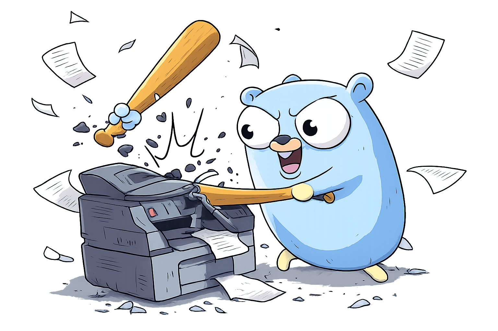

<div align="center">
  
</div>

# Epson ET-8550 Printing Tools

Professional Go-based CLI for controlling Epson ET-8550 EcoTank printer via IPP (Internet Printing Protocol).

[](https://go.dev)
[](./pkg/printer)
[](https://github.com/spf13/cobra)

---

## Features

- 🖨️ **Profile-Based Printing** - 19 predefined profiles with numeric IDs for quick access
- 📊 **Ink Level Monitoring** - Real-time monitoring of all 6 ink tanks with visual displays
- 📄 **Smart PDF Printing** - Print PDFs, images, and documents with full control
- 📋 **Status Reports** - Auto-generated PDF reports with printer status and ink levels
- 🎯 **Page Range Control** - Print specific pages: `1`, `1-5`, `2:` (from 2), `:5` (to 5)
- 🔌 **Direct IPP Communication** - No proprietary drivers needed
- 🧪 **Comprehensive Testing** - 60+ tests covering all functionality
- 💻 **Modern CLI** - Built with Cobra for excellent UX and subcommand structure

---

## Quick Start

### Installation

```bash
# Clone the repository
git clone https://github.com/Eric-Eklund/epson-printing.git
cd epson-printing

# Install dependencies
go mod download

# Build the print command
go build -o bin/print ./cmd/print

# Optional: Install to PATH
sudo cp bin/print /usr/local/bin/
```

### Configuration

Set the `PRINTER_URI` environment variable:

```bash
# For local CUPS printer (recommended)
export PRINTER_URI="http://localhost:631/printers/EPSON_ET-8550_Series"

# Or for network printer
export PRINTER_URI="http://EPSONXXXXXX.local:631/ipp/print"

# Find your printer URI
lpstat -v
```

### Basic Usage

```bash
# List all available profiles
print list

# Print a PDF with profile ID
print document.pdf 14                    # A3+ matte borderless

# Print with profile name
print photo.jpg photo-4x6-borderless-glossy

# Override settings
print document.pdf 14 --pages "2:"       # Pages 2 to end
print document.pdf 7 --quality 3         # Draft quality

# Check printer status
print test

# Generate status report
print info

# Get help
print --help
print list --help
```

---

## Commands

### Main Command: `print`

Print files (PDF, JPG, PNG, TXT, etc.) with profile-based settings.

```bash
print <file> [profile] [flags]

# Examples
print document.pdf 14                    # Profile ID 14
print photo.jpg photo-4x6-borderless-glossy  # Profile name
print calendar.pdf 14 --pages "1-5"      # First 5 pages
print document.pdf 7 -q 3                # Draft quality (-q short flag)
```

**Flags:**
- `-p, --profile` - Profile name or ID
- `--pages` - Page range: `1`, `1-5`, `2:`, `:5`
- `-q, --quality` - Quality: 3 (draft), 4 (normal), 5 (best)
- `--paper` - Paper size override
- `--tray` - Tray override
- `--media` - Media type override
- `--printer` - Printer URI (overrides env var)

### Subcommands

#### `print list` - List All Profiles

Display all 19 print profiles with IDs, names, and settings.

```bash
print list

# Output:
# Available Print Profiles:
# ========================
#
# Default:
#   0   default                              A4, Main, Plain, Quality 3
#
# 4x6" Borderless:
#   1   photo-4x6-borderless-glossy          4x6.Borderless, Photo, Glossy, Quality 5
#   2   photo-4x6-borderless-matte           4x6.Borderless, Photo, Matte, Quality 5
#   ...
```

#### `print info` - Status Report

Generate and print a PDF status report with printer information and ink levels.

```bash
print info

# Generates: printer-status-YYYYMMDD-HHMMSS.pdf
# Includes:
#   - Printer name, model, state
#   - All 6 ink tank levels with color-coded bars
#   - Program information
#   - Timestamp
```

#### `print test` - IPP Connection Test

Test IPP connection and display printer status.

```bash
print test              # Formatted output
print test --json       # JSON output

# Shows:
#   - Printer name and model
#   - Current state (Idle, Processing, Stopped)
#   - Ink levels for all 6 tanks:
#     - MB (Matte Black), PB (Photo Black)
#     - C (Cyan), Y (Yellow), M (Magenta), GY (Gray)
```

---

## Print Profiles

### Quick Reference

| ID | Profile | Paper | Media | Quality |
|----|---------|-------|-------|---------|
| 0 | default | A4 | Plain | 3 (draft) |
| 1-3 | 4x6" Borderless | 4x6.Borderless | Glossy/Matte/Semi-gloss | 5 |
| 4-6 | 5x7" Borderless | 5x7.Borderless | Glossy/Matte/Semi-gloss | 5 |
| 7-9 | A4 Borderless | A4.Borderless | Glossy/Matte/Semi-gloss | 5 |
| 10-12 | A3 Borderless | A3.Borderless | Glossy/Matte/Semi-gloss | 5 |
| 13-15 | A3+ Borderless | 13x19.Borderless | Glossy/Matte/Semi-gloss | 5 |
| 16 | document-draft | A4 | Plain | 3 |
| 17 | document-normal | A4 | Plain | 4 |
| 18 | document-best | A4 | Coated | 5 |

### Examples

```bash
# Photo printing
print photo.jpg 1                        # 4x6" glossy (ID 1)
print photo.jpg 14                       # A3+ matte (ID 14)

# Documents
print report.pdf 16                      # Draft quality
print report.pdf 17                      # Normal quality
print report.pdf 18                      # Best quality on coated paper

# Custom settings
print photo.jpg 1 --pages "1-10"         # First 10 photos from PDF
print calendar.pdf 14 --pages "2:"       # Page 2 to end
print document.pdf 17 --quality 5        # Override to best quality
```

---

## Project Structure

```
.
├── cmd/
│   ├── print/                # Main CLI (Cobra-based)
│   │   ├── main.go          # Entry point (7 lines!)
│   │   └── cmd/             # Subcommands
│   │       ├── root.go      # Main print command
│   │       ├── list.go      # List profiles
│   │       ├── info.go      # Status report
│   │       └── test.go      # IPP test
│   ├── test-print/          # Legacy test command
│   └── test-ipp/            # Legacy IPP test
├── pkg/
│   └── printer/             # Core library (reusable)
│       ├── info.go          # Printer information & status
│       ├── print.go         # PDF/file printing with page ranges
│       ├── report.go        # PDF report generation
│       ├── profiles.go      # Profile system with IDs
│       ├── options.go       # Print options
│       ├── format.go        # Output formatting
│       └── *_test.go        # 60+ comprehensive tests
├── bash/                    # Archived bash scripts
├── bin/                     # Compiled binaries (gitignored)
├── go.mod                   # Dependencies (Cobra, goipp, fpdf)
└── README.md               # This file
```

---

## Library Usage

The `pkg/printer` package can be used in your own Go programs.

### Get Printer Information

```go
import "github.com/Eric-Eklund/epson-printing/pkg/printer"

printerURI := "http://localhost:631/printers/EPSON_ET-8550_Series"

// Get printer info
info, err := printer.GetPrinterInfo(printerURI)
if err != nil {
    log.Fatal(err)
}

// Print formatted output
info.Print()

// Export to JSON
jsonData, _ := info.ToJSON()
```

### Print with Profiles

```go
// Use predefined profile by ID
profile, _ := printer.GetProfileByID(14)  // A3+ matte
opts, _ := printer.GetPrintOptions(profile)

// Or by name
opts, _ := printer.GetPrintOptions("photo-4x6-borderless-glossy")

// Customize
opts.PageRange = "2:"
opts.Quality = 3

// Print
jobID, err := printer.PrintPDF(printerURI, "document.pdf", opts)
```

### Custom Print Options

```go
opts := printer.PrintOptions{
    PaperSize: "A4.Borderless",
    Tray:      "Auto",
    MediaType: "photographic-glossy",
    Quality:   5,
    PageRange: "1-5",
    Copies:    2,
}

jobID, err := printer.PrintPDF(printerURI, "photo.jpg", opts)
```

### List Profiles Programmatically

```go
// Get all profiles with details
infos := printer.ListProfilesWithInfo()

for _, info := range infos {
    fmt.Printf("ID %d: %s - %s\n", info.ID, info.Name, info.Description)
}

// Get profile ID from name
id := printer.GetProfileID("photo-a3plus-borderless-matte")  // Returns 14
```

---

## Testing

```bash
# Run all tests
go test -v ./...

# Run specific package
go test -v ./pkg/printer

# With coverage
go test -cover ./pkg/printer

# Integration tests (requires printer)
INTEGRATION_TEST=1 go test -v ./pkg/printer
```

**Test Coverage:**
- ✅ 60+ tests passing
- ✅ Info, print, report, profiles, options, format modules
- ✅ Page range parsing (all formats)
- ✅ Profile system (19 profiles + custom)
- ✅ Edge cases and error handling

---

## Advanced Features

### Page Range Syntax

```bash
# Single page
print document.pdf 14 --pages "1"

# Range
print document.pdf 14 --pages "1-5"      # Pages 1 to 5

# From page N to end
print document.pdf 14 --pages "2:"       # Pages 2 to end

# First N pages
print document.pdf 14 --pages ":5"       # Pages 1 to 5

# Comma-separated (prints first only)
print document.pdf 14 --pages "1,3,5"    # Prints page 1
```

### Global Flags

The `--printer` flag works with all commands:

```bash
print --printer "http://other-printer:631/ipp/print" test
print --printer "http://other-printer:631/ipp/print" info
```

### Shell Completion

Cobra provides free shell completion:

```bash
# Bash
print completion bash > /etc/bash_completion.d/print

# Zsh
print completion zsh > ~/.zsh/completion/_print

# Fish
print completion fish > ~/.config/fish/completions/print.fish
```

---

## Technical Details

### IPP Protocol

Direct printer communication using IPP (Internet Printing Protocol):

- **Standard:** RFC 8010 (IPP/1.1)
- **Transport:** HTTP/HTTPS
- **Operations Used:**
  - `Get-Printer-Attributes` - Retrieve status and capabilities
  - `Print-Job` - Submit print jobs
- **No Proprietary Drivers** - Pure IPP implementation

### Dependencies

```go
require (
    github.com/OpenPrinting/goipp v1.2.0     // IPP protocol
    github.com/go-pdf/fpdf v0.9.0            // PDF generation
    github.com/spf13/cobra v1.10.2           // CLI framework
)
```

### Ink Tank System

The ET-8550 uses a 6-color ink system:

- **MB** - Matte Black (documents)
- **PB** - Photo Black (photos)
- **C** - Cyan
- **Y** - Yellow
- **M** - Magenta
- **GY** - Gray (smooth tones)

---

## Future Development

### Planned Features 🚀

**In Progress:**
- [ ] `print batch` - Batch photo printing from folder (replacing bash script)

**Short-term:**
- [ ] Print job queue monitoring
- [ ] Saved presets (user-defined profiles)
- [ ] Waste ink level monitoring
- [ ] Print cost estimation

**Medium-term:**
- [ ] Desktop GUI (Fyne framework)
- [ ] Web interface for remote printing
- [ ] Historical ink usage tracking
- [ ] Email alerts for low ink

**Long-term:**
- [ ] REST API server
- [ ] Mobile companion app
- [ ] Multi-printer support
- [ ] Color profile management
- [ ] Support for other Epson EcoTank models

---

## Why Cobra?

The CLI uses [Cobra](https://github.com/spf13/cobra), the standard for professional Go CLIs:

**Used by:** `kubectl`, `docker`, `hugo`, `gh` (GitHub CLI)

**Benefits:**
- ✅ Clean subcommand structure
- ✅ Auto-generated help text
- ✅ POSIX-compliant flag parsing
- ✅ Shell completion support
- ✅ Easy to extend (add `print batch`, etc.)

---

## Troubleshooting

### "PRINTER_URI environment variable not set"

```bash
export PRINTER_URI="http://localhost:631/printers/EPSON_ET-8550_Series"

# Or use --printer flag
print --printer "http://..." test
```

### "connection refused"

- Check CUPS is running: `systemctl status cups`
- Verify printer is on and connected
- Check URI: `lpstat -v`

### "unknown profile ID"

```bash
# List all profiles to see valid IDs (0-18)
print list
```

### Page range not working

Page ranges are validated:
- ✅ Valid: `1`, `1-5`, `2:`, `:5`, `all`
- ❌ Invalid: `1,3,5` (comma-separated prints first only)

---

## Resources

**Documentation:**
- [SETUP.md](./SETUP.md) - Detailed setup guide
- [CLAUDE.md](./CLAUDE.md) - Development context & session history

**Libraries:**
- [Cobra CLI](https://github.com/spf13/cobra) - CLI framework
- [OpenPrinting goipp](https://github.com/OpenPrinting/goipp) - IPP protocol
- [go-pdf/fpdf](https://github.com/go-pdf/fpdf) - PDF generation

**Printer:**
- [Epson ET-8550](https://epson.com/ecotank-et-8550) - Product page
- 6-color ink system, A3+ (13x19") max size
- Network & USB connectivity

---

## Contributing

Contributions welcome! Areas of interest:
- Additional printer model support
- GUI development (Fyne/Gio)
- Feature requests and bug reports
- Documentation improvements

---

## License

Personal project - check individual library licenses for dependencies.

---

## Acknowledgments

- [Cobra](https://github.com/spf13/cobra) - Excellent CLI framework
- [OpenPrinting](https://openprinting.github.io/) - goipp library
- [go-pdf](https://github.com/go-pdf/fpdf) - PDF generation
- CUPS project - IPP implementation

---

**Project Status:** ✅ Production Ready
**Last Updated:** January 3, 2026
**CLI Framework:** Cobra
**Profiles:** 19 predefined + custom support
**Tests:** 60+ passing
**Go Version:** 1.18+
**Author:** Eric Eklund
